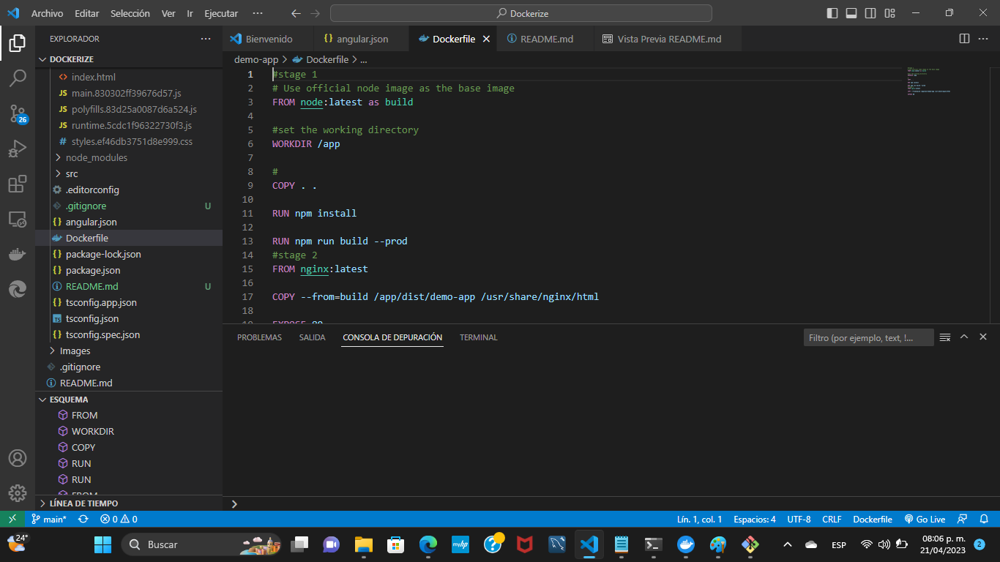

# Dockerize an Angular Project 
## Installation
1. Download and install **Node.js** via this [link](https://nodejs.org/es/download/)

!!! To verify if the installation was correct, type in your Command Prompt(Windows) to check the **Node.js**  and **npm** version

``` 
node --version
```
and
``` 
npm --version
```
2. Donwload and install **Angular-Cli**, visit this [link](https://cli.angular.io/) or type in your Command Prompt (Windows)

``` 
npm install -g @angular/cli
```
!!!!!!If you want a different version of **Angular-Cli** you can type instead
``` 
npm install -g @angular/cli@{version}

example

npm install -g @angular/cli@7.0.3
```

!!! To verify if the installation was correct, type in your Command Prompt(Windows) to check the **Angular-Cli** version

``` 
ng version
```
3. Download and install an Editor:
- __[Atom](https://atom.io/)__
- __[Visual Studio Code](https://code.visualstudio.com/docs)__
- __[Sublime Text](https://www.sublimetext.com)__

## Angular 
``` 
ng help
```
- Create a new project: select your folder file and type on your Command Prompt(Windows)
``` 
ng new {file-name}
example
ng new todo
```
- Build and run an **Angular** application (you need to be inside the Project folder)
``` 
ng serve
```
!!!!!! To stop an **Angular** Application, type Ctrl+C to end the ongoing process (Windows)

- To check if exist any coding standar violation type `ng lint` on your Command Prompt(Windows)
- If you type `ng build` on your Command Prompt(Windows), it creates files that make easy the deployment on a web server, like test enrollment, production, etc. (so you don´t need to attatch all the files to make run the **Angular** Application)
- Type `ng test` to run the unit tests on the **Angula** Application
- Type `ng e2e` to run the entire **Angular** Application
- Type `ng generate component {component name}` to create a new component inside your **Angular** Application
example
``` 
ng generate component welcome 
```
!!! This commando don´t have rollback so you need to be a 100% that everything is right before execute it 

## Dockerizing an Angular Project (example)
- Create a new project (demo-app): select your folder file and type on your Command Prompt(Windows)
``` 
ng new demo-app
```
- Build and run your **Angular** application (you need to be inside the demo-app folder) to verify if it is running
``` 
ng serve
```
!!!!!! To stop your **Angular** Application, type Ctrl+C to end the ongoing process (Windows)
- Build your **Angular** application
``` 
ng build
```
- Create a Dockerfile inside your **Angular** project folder (demo-app) and type
``` 
# Stage 1

# Use official node image as the base image
FROM node:latest as build

# Set the working directory
WORKDIR /app

# Add the set course
COPY . .

# Install all the dependencies
RUN npm install

RUN npm run build --prod

# Stage 2
FROM nginx:latest

# Use official nginx image as the base image
COPY --from=build /app/dist/{app-name} /usr/share/nginx/html

# Select the port
EXPOSE {port}
```
- In this case {app-name} is demo-app and {port} is 80:

``` 
# Stage 1

# Use official node image as the base image
FROM node:latest as build

# Set the working directory
WORKDIR /app

# Add the set course
COPY . .

# Install all the dependencies
RUN npm install

RUN npm run build --prod

# Stage 2
FROM nginx:latest

# Use official nginx image as the base image
COPY --from=build /app/dist/demo-app /usr/share/nginx/html

# Select the port
EXPOSE 80
```
### Building a Docker Image on Command Prompt(Windows)
- Build your Application Image, type on your Command Prompt(Windows)
 ```
docker build -t {dockerhub_name}/{image_name}:{tag dockerfile_location}
#Example
docker build -t spikanor1320/demo-app:latest
# Or
docker build -t spikanor1320/demo-app
 ```
!!!!!! To build a **Docker** Image of your **Angular** project you need a **Docker-hub** account, so create a new user or login into __[Docker-hub](https://hub.docker.com/)__
- Once your docker image build is finished, run your image into a **Container**, type on your Command Prompt(Windows)
 ```
docker run -d -it -p 80:80/tcp --name demo-app {dockerhub_name}/{image_name}:{tag dockerfile_location}
#Example
docker run -d -it -p 80:80/tcp --name demo-app spikanor1320/demo-app:latest
 ```
 ### Building a Docker Image in an Editor (VisualStudioCode)
 - Open your Project folder into your Editor (VisualStudioCode) and open your Dockerfile

- Right click into your Dockerfile and click into Build Image...

- Wait until your Build Image is done

- And open your **Docker Desktop** into the Image section

- Click on Run and Create a Run new container {container-name} -> Demo and {port}-> 8080


## Helpfull Resources
__[Link 1](https://plainenglish.io/blog/how-to-dockerize-angular-application-3cd67e963832#3-build-the-containers)__
__[Link 2](https://medium.com/codex/dockerize-angular-application-69e7503d1816)__
__[You Tube video](https://www.youtube.com/watch?v=GXf0y_nUIZE)__

